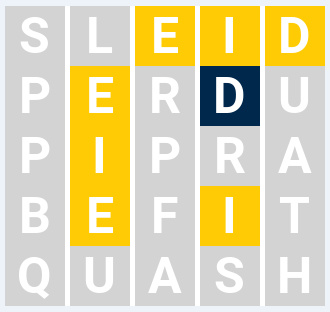

# About

Smart bot in Python for a guess-the-word game. The bot uses image recognition to read game state and make a smart guess based on the feedback.

# Rules

Each guess is a five letter English word. Only the 26 letters of the English alphabet are used, and case does not matter.

The game engine generates a hidden 5-letter word called the target word. The bot attempts to guess that word.

The bot is given the location of a datafile which has a list of allowable words (one per line). The bot only makes guesses from this datafile.

After each guess the system provides feedback indicating if each character is in the correct position for the target word, and if not, if the character is in the target word but in the wrong position.

The bot is "smart" in that once it has identified the correct location of a letter in a word it only guesses future words where that letter is in the same position.

This version of the game receives a game state (board image) from the wordy.py module and provides a next good guess based on the information provided. The program uses Pytesseract OCR and PIL Image libraries to parse information from the image. 

A good guess is one which:
* Continues to adhere to the rules
* Does not repeat words which have already been played
* Uses the knowledge of previous guesses to pick a new good word

# Example

Launch "game_wordy.py" to play. Game state (image) provided to the bot:

* Blue background: the letter is in the guessed word and in the correct position
* Yellow background: the letter is in the guessed word but in the wrong position
* Gray background: the letter is not in the guessed word

Bot guess: 'IMIDE', based on the information provided in the game state.

# Libraries

* pillow==10.4.0
* pytesseract==0.3.13
* Install Google Tesseract OCR: https://github.com/tesseract-ocr/tesseract and provide a path to executable in "pytesseract.pytesseract.tesseract_cmd".
